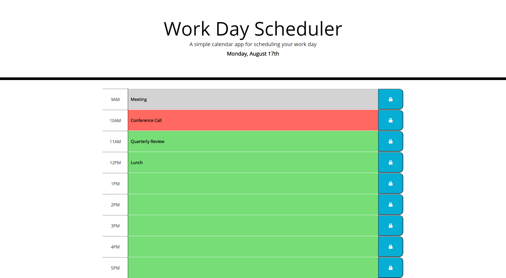

# Day-Planner

## Introduction

My task for this assignment was to build a simple calendar application that allows the user to save events for each hour of the day. I used the Moment.js library to display the date and work with the current time. 

## Instructions

Each time block is color coded to indicate whether it is in the past, present, or future. When the user clicks into the text-input box, they may type some data. When they click the save button the data will be stored locally. When the page is refreshed the data will persist in the input box. 

## Technologies

* HTML
* CSS
* JavaScript
* JQuery
* Moment.js

## Deployed

[GitHub Repo](https://github.com/bosshogg86/day-planner)

[Day-Planner](https://bosshogg86.github.io/day-planner)

